<!--
  This is your PROFILE README. It goes in a repo named exactly after your
  username (github.com/RaghavParasher/RaghavParasher) so GitHub shows it on your profile.
-->

<table border="0" cellspacing="0" cellpadding="0">
<tr>
<td valign="top" width="48%">

</td>
<td valign="top"></td>
</tr>
</table>

## Raghav Parasher

**Software Engineer · Full Stack Developer · MERN Stack Developer**

 

  <b>Frontend:</b>
  
  
  
  
  &nbsp;&nbsp;•&nbsp;&nbsp;
  <b>Backend:</b>
  
  
  
    
  <b>Cloud & Tools:</b>
  
  
  
  
  

 

### 🛠️ Featured Projects

| Project | Description | Stack / Badge |
| :--- | :--- | :--- |
| 🎓 **[skillforge-academy](https://github.com/RaghavParasher/skillforge-academy)** | Interactive tech education and online learning platform designed to streamline knowledge delivery. |   |
| ⚡ **[ai-study-buddy](https://github.com/RaghavParasher/ai-study-buddy)** | Intelligent LLM-powered study assistant and learning companion for summarizing notes and answering queries. |   |
| 💸 **[equisplit](https://github.com/RaghavParasher/equisplit)** | Shared expense tracker and splitter application to manage group payments and balance sheets. |   |
| ☁️ **[skypulse-weather](https://github.com/RaghavParasher/skypulse-weather)** | Responsive weather forecasting web application with sleek animations and localized weather data. |   |

 

<!-- Snake Game contribution graph -->
<h3>👾 Contribution Snake</h3>
<picture>
  <source media="(prefers-color-scheme: dark)" srcset="https://raw.githubusercontent.com/RaghavParasher/RaghavParasher/output/github-contribution-grid-snake-dark.svg">
  <source media="(prefers-color-scheme: light)" srcset="https://raw.githubusercontent.com/RaghavParasher/RaghavParasher/output/github-contribution-grid-snake.svg">
  
</picture>

  

<!-- animated contribution graph, refreshed daily by the workflow -->

<!-- pr 1 comment -->
<!-- refresh trigger -->
